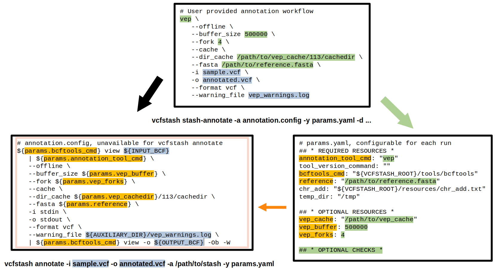

# **VCFstash – Fast, Flexible, and Reliable Variant Annotation Caching**

Stop re-annotating the same common variants over and over.  
`VCFstash` builds a **local, shareable cache** of already-annotated alleles and
lets your preferred tool (VEP, ANNOVAR, SnpEff, …) skip straight to the novel
ones. **Save more than 70% of your annotation time** with minimal changes to your existing pipeline.

---

## ✨ Features

- **Speed**: Typically reduces annotation run time by more than 70% by caching common variants
- **Flexibility**: Works with any annotation tool (VEP, SnpEff, ANNOVAR, custom scripts)
- **Simplicity**: Easy integration with existing pipelines
- **Efficiency**: Automatic variant normalization and deduplication
- **Portability**: Shareable caches for easy collaboration
- **Reliability**: Built-in checks for data integrity and consistency
- **Configurable**: YAML-based configuration for easy customization and environment adaptation
- **Tested**: Comprehensive test suite to ensure correctness and reliability
- **Documentation**: Detailed usage instructions and examples
- **Resource Management**: Optional Nextflow configuration for CPU and memory management
- **Lightweight**: Minimal dependencies, no external tools required for basic functionality
- **Open Source**: Available under the MIT License

---

## 🛠️ Quick Setup

### Prerequisites

VCFstash requires:
- Python 3.11 or higher
- Java Runtime Environment (JRE) 17 or higher for Nextflow execution
- tabix for VCF/BCF handling
- [uv](https://github.com/astral-sh/uv) for package management

On Ubuntu/Debian systems, you can install the required dependencies using:
```bash
sudo apt-get update
sudo apt-get install openjdk-17-jre-headless tabix
```

For other operating systems, please install Java from [OpenJDK](https://openjdk.org/) or your preferred distribution.

### Installation
VCFstash uses [uv](https://github.com/astral-sh/uv) for fast, reliable package management and flit as the build backend.

```bash
# Clone the repository
git clone git@github.com:julius-muller/vcfstash.git
cd vcfstash

# Install uv if you don't have it already following https://docs.astral.sh/uv/getting-started/installation/

# Create a virtual environment and install vcfstash
uv venv
source .venv/bin/activate

# Install build dependencies first
uv pip install hatchling editables

# Install vcfstash in editable mode
uv pip install -e .

# With Parquet support (optional)
uv pip install -e ".[parquet]"

# With development dependencies (for running tests)
uv pip install -e ".[dev]"

```

That's it! VCFstash includes all required tools (bcftools, Nextflow) in the repository.

### Testing Your Installation

After installation, it's recommended to run the test suite to verify everything is working correctly:

```bash
# Run all tests (takes about a minute)
python -m pytest

# Run specific tests with increased verbosity
python -m pytest -xvs tests/test_core.py
```

### Docker Installation

VCFstash can also be run using Docker:

```bash
# Build the Docker image
docker build -f docker/Dockerfile -t vcfstash .
# or using docker-compose
docker-compose -f docker/docker-compose.yml build

# Run VCFstash with Docker
docker run --rm -v $(pwd):/data vcfstash --help
```

For more detailed Docker instructions, see the [Using Docker](#using-docker) section below or the [Wiki](WIKI.md#using-docker).

---

## 🏁 3-step quick-start for setting up a new cache

1. **Create a blueprint** from a representative VCF
   ```bash
   vcfstash stash-init -i gnomad_4_wgs.vcf -o /my/destination/dir -y params.yaml
   ```

2. **Run your annotation tool once** on the blueprint and freeze it
   ```bash
   vcfstash stash-annotate -d /my/destination/dir -n vep_gnomad -a example_annotation.config
   ```

3. **Annotate your samples** using the cache
   ```bash
   vcfstash annotate -a /my/destination/dir/stash/vep_gnomad --vcf sample.vcf --output results
   ```

**Optional:** Add more variants to your cache (e.g., merge gnomAD WES into WGS blueprint)
```bash
vcfstash stash-add -i gnomad_4_wes.vcf -d /my/destination/dir
```

Your `annotation.config` contains **exactly** the command you already use – see next section for details.

---

## 🔄 Converting your existing annotation command

VCFstash works with **any annotation tool** by wrapping your existing command. Just split it into two parts:

1. **annotation.config**: Your command structure which will be applied to cache *and* input vcf files. This file is fixed at stash-annotate and unavailable at vcfstash annotate! 
2. **params.yaml**: Configurable values (paths, resources) which can be changed for each run




### Example: From VEP command to VCFstash

#### Original command:

```bash
   vep \
   --offline \
   --buffer_size 500000 \
   --fork 4 \
   --cache \
   --dir_cache /path/to/vep_cache/113/cachedir \
   --fasta /path/to/reference.fasta \
   -i sample.vcf \
   -o annotated.vcf \
   --format vcf \
   --canonical
```

### Step 1: Create annotation.config

As a first step, the original annotation command needs to be adapted to the VCFstash format and copied to the .config file.

Conventions here are:
1. The annotation tool command should be replaced by ${params.annotation_tool_cmd} and the actual command should be listed in the params.yaml file.
2. The input filename has to be replaced with the variable \\${INPUT_BCF}
3. The output filename hat to be replaced with the variable \\${OUTPUT_BCF}

```bash
   ${params.annotation_tool_cmd} \
   --offline \
   --buffer_size 500000 \
   --fork 4 \
   --cache \
   --dir_cache /path/to/vep_cache/113/cachedir \
   --fasta /path/to/reference.fasta \
   -i \${INPUT_BCF} \
   -o \${OUTPUT_BCF} \
   --format vcf \
   --canonical 
```

If there are any parts of the command that need to be kept configurable during vcfstash annotate (e.g., paths, parameters), they have to be replaced with the corresponding variable names starting with `params.`, and listed under 'OPTIONAL RESOURCES' within the params.yaml file:

```bash
   ${params.annotation_tool_cmd} \
   --offline \
   --buffer_size ${params.vep_buffer} \
   --fork ${params.vep_forks} \
   --cache \
   --dir_cache ${params.vep_cache}/113/cachedir \
   --fasta ${params.reference} \
   -i \${INPUT_BCF} \
   -o \${OUTPUT_BCF} \
   --format vcf \
   --canonical 
```

If the annotation tool (here vep) doesn't support bcf as input, the input file needs to be converted and ideally piped through bcftools view. Similarly, the output is expected to be an indexed bcf file. If the tool does not natively support such output, it can be piped through bcftools view with option -W for conversion. Instead of piping, the conversion could be done in multiple steps, however this is not recommended as it would require writing the intermediate files to disk. 

```bash
annotation_cmd = """
   ${params.bcftools_cmd} view ${INPUT_BCF} 
   | ${params.annotation_tool_cmd} \
   --offline \
   --buffer_size ${params.vep_buffer} \
   --fork ${params.vep_forks} \
   --cache \
   --dir_cache ${params.vep_cachedir}/113/cachedir \
   --fasta ${params.reference} \
   -i stdin \
   -o stdout \
   --format vcf \
   --canonical \
   | ${params.bcftools_cmd} view -o ${OUTPUT_BCF} -Ob --write-index
    """
```

Finally the expected tag in the output file needs to be specified using `must_contain_info_tag`:
```bash
    must_contain_info_tag = 'CSQ'
```

#### **Important requirements for annotation.config:**

- **${INPUT_BCF}**: This variable must be used as the input source. It represents an indexed BCF file that VCFstash will provide to your annotation pipeline.
- **${params.bcftools_cmd}**: Use this to convert or pipe the input as needed for your annotation tool.
- **${OUTPUT_BCF}**: Your command must output an indexed BCF file using this variable name. The final output must be in BCF format with an index.

The example above shows a typical pattern: read from ${INPUT_BCF}, pipe through your annotation tool, and write the result to ${OUTPUT_BCF} with indexing.

#### Variable Substitution in Annotation Commands
When writing your annotation command in `annotation.config`, you can use the following variables that will be automatically replaced with the correct paths: 
- Path to the input BCF file `INPUT_BCF`
- Path where the annotated BCF file should be written `OUTPUT_BCF`
- Directory where additional files can be written (auxiliary subdirectory of cwd) `AUXILIARY_DIR`

These variables can be used in either format:
- Plain format: `INPUT_BCF`, `OUTPUT_BCF`, `AUXILIARY_DIR`
- Shell variable format: `${INPUT_BCF}`, `${OUTPUT_BCF}`, `${AUXILIARY_DIR}`

### Step 2: Create params.yaml

As a second step, the parameters need to be defined in the params.yaml file. The YAML file is structured into three main sections:

#### 1. REQUIRED RESOURCES

These are essential parameters that must be defined and are used by the core functionality:

```yaml
## * REQUIRED RESOURCES *
# Do not change the key names in this section, as they are used in the code.

# Tool paths and commands
annotation_tool_cmd: "vep"
tool_version_command: "vep | grep -oP \"ensembl-vep\\s+:\\s+\\K\\d+\\.\\d+\""

# bcftools - best to leave as default since this is the tested and shipped version v1.20
bcftools_cmd: "${VCFSTASH_ROOT}/tools/bcftools"

# Reference data required for the normalization step
reference: "/path/to/reference.fasta"

# Mapping of chromosome names between the reference genome and the VCF file
chr_add: "${VCFSTASH_ROOT}/resources/chr_add.txt"

# Temporary directory for storing intermediate files
temp_dir: "/tmp"
```

#### 2. OPTIONAL RESOURCES

These parameters can be customized for each annotation run and are referenced in your annotation.config file:

```yaml
## * OPTIONAL RESOURCES *
# All keys here can be utilized in the example_annotation.config file as ${params.MYKEY}
vep_buffer: 500000
vep_forks: 4
vep_cache: "/path/to/vep_cachedir"
```

#### 3. OPTIONAL CHECKS

These parameters provide verification mechanisms to ensure consistency between cache creation and annotation:

```yaml
## * OPTIONAL CHECKS *
# Optional checks and verifications. These can be set to any key:value pair, 
# but all keys must match the values in the example_annotation.config.
optional_checks:
  reference_md5sum: "28a3d9f0162be1d5db2011aa30458129"
  # Add other optional verifications here
  # example_version: "1.2.3"
  # example_option: "value"
```

The final example of the params.yaml can be found here: [test_params.yaml](tests/config/test_params.yaml) and for annotation.config here: [test_annotation.config](tests/config/test_annotation.config).

> **Important**: It is the responsibility of the user that any optional resource listed here impacting annotation results is never changed between cache creation and annotation. The optional checks section helps enforce this consistency.

## 📋 Command Reference

VCFstash provides four simple commands that follow the workflow shown in the quick-start:

1. `stash-init`: Create a new cache from a representative VCF (e.g., gnomAD)
2. `stash-add`: Add more variants to an existing cache
3. `stash-annotate`: Run your annotation tool once on the cache
4. `annotate`: Annotate your samples using the cache

Full documentation with all options is available by running:
```bash
vcfstash -h
```

## 🚀 Running annotation anywhere using the cache

Once your cache is set up, you can run the annotation command **anywhere** the cache is available - perfect for distributed computing environments or sharing with collaborators:

```bash
vcfstash annotate -a /path/to/cache/stash/my_annotation \
    --vcf sample.vcf.gz \
    --output results \
    -y params.yaml
```

Just make sure your `params.yaml` file is properly configured for the new environment. This portability means you can:

- Run annotations on different compute clusters
- Share pre-built annotation caches with team members
- Integrate with any workflow management system
- Use Docker for consistent environments (see [Using Docker](#using-docker))

## 🖥️ Resource Management

VCFstash supports optional resource management through Nextflow configuration. Create a `nextflow.config` file to control CPU, memory, and other resources:

```groovy
// Process configuration
process {
    executor = 'local'
    cpus = 4               // Default CPUs for all processes
    memory = '8 GB'        // Default memory for all processes

    // Process-specific settings
    withName: 'RenameAndNormalizeVCF' {
        memory = '20 GB'   // More memory for this specific process
    }
}
```

This configuration is optional - VCFstash will work with default settings, but customizing resources can improve performance for your specific environment.


# Cache Structure

The VCFstash cache is organized in a structured directory hierarchy that maintains both the normalized variants and their annotations. Understanding this structure can help you manage and troubleshoot your caches.

## Directory Structure

```
cache_directory/
├── blueprint/                  # Contains normalized variants
│   ├── vcfstash.bcf            # Normalized variants from input VCF files
│   ├── vcfstash.bcf.csi        # Index for the normalized variants
│   ├── sources.info            # Information about input VCF files
│   └── ...                     # Nextflow reports and logs
│
├── stash/                      # Contains annotated variants
│   └── [annotation_name]/      # Named annotation directory (e.g., "vep_gnomad")
│       ├── annotation.config   # Locked annotation configuration
│       ├── blueprint_snapshot.info  # Blueprint info at annotation time
│       ├── vcfstash_annotated.bcf   # Annotated variants
│       ├── vcfstash_annotated.bcf.csi  # Index for annotated variants
│       ├── annotation.yaml         # Configuration for annotation tools
│       └── ...                 # Nextflow reports and logs
│
├── workflow/                   # Contains Nextflow workflow files
│   ├── init.yaml               # Initial configuration
│   ├── main.nf                 # Nextflow workflow file
│   ├── modules/                # Nextflow modules
│   └── ...                     # Workflow logs
│
└── vcfdb.log                   # Log file for cache operations
```

## Key Files Explained

### Blueprint Files

- **vcfstash.bcf**: The core normalized variant database containing all variants from input VCF files. This file is created during `stash-init` and updated during `stash-add`.
- **sources.info**: JSON file tracking all input VCF files that have been added to the cache, including their MD5 checksums and timestamps.

### Stash Files

- **annotation.yaml**: Contains configuration for annotation tools, including paths, commands, and resource settings.
- **annotation.config**: The locked annotation configuration that defines exactly how variants are annotated. This file is frozen after `stash-annotate` to ensure consistency.
- **blueprint_snapshot.info**: Records the state of the blueprint at the time of annotation, ensuring traceability.
- **vcfstash_annotated.bcf**: The annotated variant database that serves as the cache for future annotations.

### Workflow Files

- **init.yaml**: Initial configuration used by the Nextflow workflow.
- **main.nf**: The Nextflow workflow that orchestrates the normalization and annotation processes.

## Cache Lifecycle

1. **Initialization** (`stash-init`): Creates the blueprint directory and normalizes input variants
2. **Addition** (`stash-add`): Updates the blueprint with additional variants
3. **Annotation** (`stash-annotate`): Creates a named annotation in the stash directory
4. **Usage** (`annotate`): Uses the annotated cache to speed up annotation of new samples

Understanding this structure helps when:
- Troubleshooting annotation issues
- Managing multiple annotation versions
- Sharing caches between environments
- Backing up or archiving caches

The cache is designed to be portable - you can copy an entire cache directory to another location or system and use it there, as long as the paths in your `params.yaml` file are updated accordingly.

## 💡 Performance Tips

- **Start with quality data**: Use a large, comprehensive variant database (like gnomAD) for initialization
- **Keep cache size manageable**: Using only common alleles (e.g., 10% allele frequency or higher) provides excellent performance while avoiding huge caches
- **Benefit from scale**: For large cohorts, the speedup increases with each additional sample added to the cache 
- **Optimize I/O**: Consider using SSD storage for the cache directory to maximize performance
- **Parallelize wisely**: Adjust CPU and memory settings in the Nextflow configuration based on your available resources

## 🐳 Using Docker

VCFstash provides Docker support for easy deployment and consistent execution across different environments.

### Basic Docker Usage

```bash
# Build the Docker image
docker build -f docker/Dockerfile -t vcfstash .

# Run VCFstash with Docker
docker run --rm vcfstash --help

# Mount volumes for data access
docker run --rm \
  -v /path/to/reference:/reference:ro \
  -v /path/to/data:/data \
  -v /path/to/cache:/cache \
  vcfstash stash-init \
  --vcf /data/gnomad.vcf.gz \
  --output /cache \
  -y /data/params.yaml
```

### Using Docker Compose

VCFstash includes a Docker Compose configuration for easier management of volumes and environment variables:

```bash
# Set environment variables (optional)
export REFERENCE_DIR=/path/to/reference
export DATA_DIR=/path/to/data
export CACHE_DIR=/path/to/cache

# Run VCFstash with Docker Compose
docker-compose -f docker/docker-compose.yml run --rm vcfstash <command> <options>
```

### Helper Script

For convenience, use the provided helper script:

```bash
# Make the script executable
chmod +x docker/run-vcfstash.sh

# Run VCFstash using the helper script
./docker/run-vcfstash.sh <command> <options>
```

For more detailed Docker instructions and examples, see the [Wiki](WIKI.md#using-docker).

## 🧪 Testing & Validation

VCFstash includes comprehensive tests to ensure reliability and correctness:

```bash
# Install development dependencies
uv pip install -e ".[dev]"

# Run all tests
python -m pytest

# Run specific test with increased verbosity
python -m pytest -xvs tests/test_core.py
```

### Test Structure

The test suite is organized into two modules:

- `test_core.py`: Tests basic utility functions like MD5 calculation
- `test_annotate.py`: Tests the annotate command and full workflow

Each test prints information about which part of the code is being tested, making it easier to understand test coverage.

### Test Implementation

The tests are designed to run on any system after installation of the package, without requiring external annotation tools. They use:

- `tests/config/test_params.yaml`: Configuration for the test annotation tool (bcftools)
- `tests/config/test_annotation.config`: Configuration for the test annotation command

The tests create temporary directories for output and clean up after themselves. They use bcftools (included in the package) to simulate annotations, making the tests portable and reliable.

### Running Tests

To run the tests:

```bash
# Run all tests
python -m pytest

# Run a specific test file
python -m pytest tests/test_annotate.py

# Run a specific test with increased verbosity
python -m pytest -xvs tests/test_annotate.py::test_annotate_workflow
```

All tests should pass on any system where the package is installed, without requiring any external tools or configuration.

## 📜 Changelog

See [CHANGELOG.md](CHANGELOG.md) for a detailed list of changes and improvements.


## 🙏 Acknowledgements

- [uv](Jhttps://github.com/astral-sh/uv) for fast package management
- [Nextflow](https://www.nextflow.io/) for workflow management
- [bcftools](https://github.com/samtools/bcftools) for efficient variant processing
- [pytest](https://docs.pytest.org/) for testing framework

## License

VCFstash is available under the MIT License - see the LICENSE file for details.
